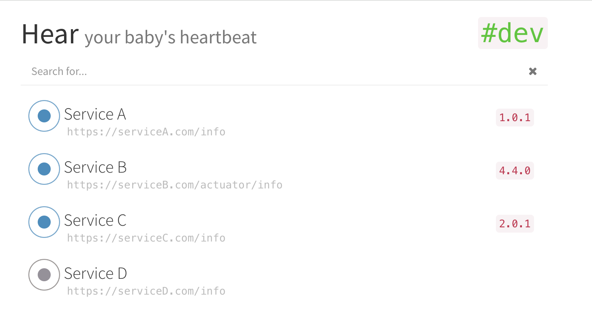

### Overview
**Problem**: Determining the version of specific components running in each environment is challenging.\
**Solution**: A service that automatically checks the health and version information of other services and displays the results on a web page.\
**Status**: Finished, using in company.

----

## Heartbeats
A service that automatically checks the health and version information of other services and displays the results on a web page
<div align="center">
    
</div>

## Configuration
```json
{
  "places": {
    "group1": [
      {
        "url": "http://service1:8080"
      },
      {
        "url": "http://service2:8081",
        "info": {
          "app": {
            "name": "default_name"
          }
        }
      }
    ],
    "group2": [
      {
        "url": "http://service3:8080"
      }
    ]
  }
}
```
## Launch
```
go build heartbeats.go
./heartbeats -port=8080
```
